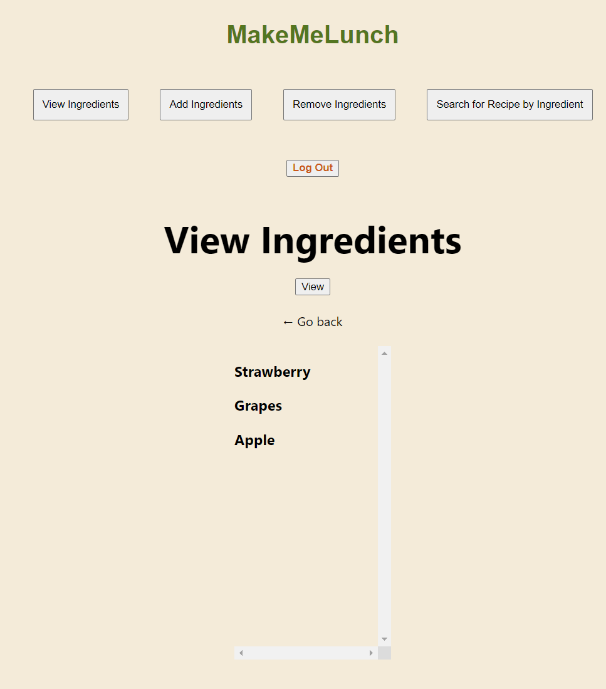
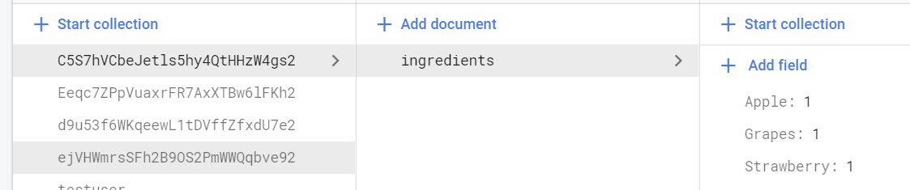
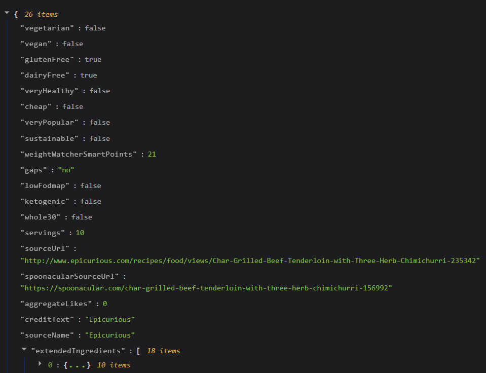
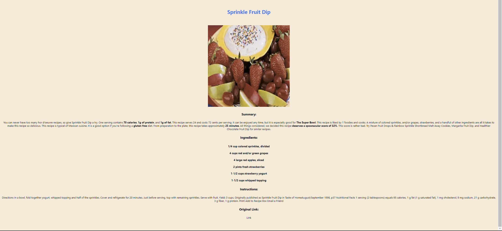

# MakeMeLunch

## Demo Link

[Website](https://www.makemelunch.xyz)

## 💡Inspiration

Our inspiration came from some of the common problems we face in preparing everyday meals. If we don't keep track of what ingredients we have, that zucchini in the forgotten corner of the fridge goes bad, inevitably becoming wasted food.

Additionally, repeatedly eating the same dish is a recipe to never wanting to eat said dish ever again. That being said, the same ingredients can make many different dishes, and trying new ideas helps prevent getting sick of repeatedly eating the same foods.

MakeMeLunch is designed to tackle both of these problems, providing an ingredient tracker and its relevant recipes.

## 💻What it does

• Allows a user to create an account to store a list of kitchen ingredients.

• Stores a list of ingredients in a database unique to each user.

• Displays relevant food recipes based on a user's stored list of ingredients.

List of Ingredients for a given user:

## 🛠️How we built it

• Next.js

• JavaScript

• [Spoontacular API](https://rapidapi.com/spoonacular/api/recipe-food-nutrition) for ingredient and recipe data

• [Firebase Authentication](https://firebase.google.com/docs/auth)

• [Firebase Firestore Realtime Database](https://firebase.google.com/docs/firestore)

• [Vercel](https://vercel.com/)

• Axios

Data in database:

## 🛑Challenges we ran into

• learning next.js in one day with no prior knowledge on js, html, and react

• figuring out Api calls in next.js and how to parse them

• troubles with fast refresh, must reboot app to see changes

• incorporating firebase and spoonacular api into project

• Hackathon only lasted for one day so a big time crunch

Example of a typical api response:

## ✅Accomplishments that we're proud of

• Successfully implemented Firebase Auth and linking authentication with Firestore Realtime Database

• Successfully allowed data transfer between two completely different APIS.

• Successfully sent and received Spoonacular API calls through Axios.

• Managing to successfully implement backend and frontend within 1 day.

Successfully receiving an api response and displaying it after parsing:

## 📖What we learned

• JavaScript scripting

• HTML and CSS formatting through React

• API calls through Axios

## ⚠️ Known problems

• View Ingredients Crashs if no ingredients added

• Security flaws in Environmental Variables

• Security flaws in database rules

## 🛣️ Future Plans

• Filters for recipe search, eg calories

• UI improvements

• Options to display healthier substitutes for certain recipe ingredients

• Security improvements

• Edge Case resolution
